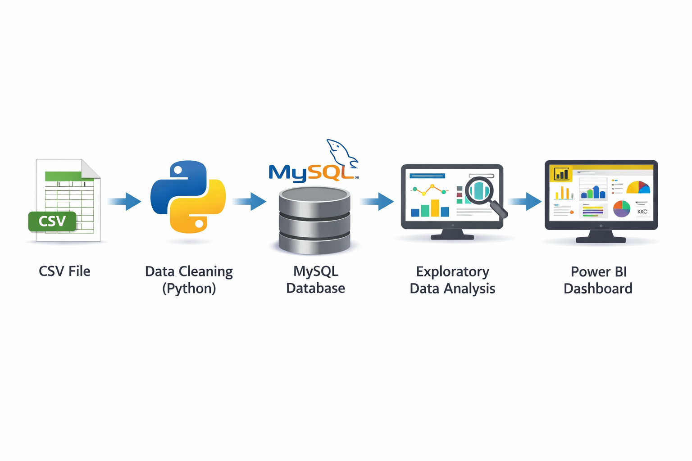

# 🚀 Retail Sales Intelligence Dashboard

## 📌 Problem Statement

Businesses often struggle to extract meaningful insights from raw sales data.
This project focuses on transforming transactional retail data into actionable insights that support data-driven decision-making.

---

## 📖 Project Flow

This project simulates a real-world retail analytics scenario where raw sales data is processed, analyzed, and visualized to uncover key business insights.

The objective was to enable stakeholders to:

* Understand revenue drivers
* Identify high-performing regions and categories
* Analyze customer behavior
* Support strategic business decisions

---

## 🛠️ Tools & Technologies

* **Python** (Pandas, NumPy) – Data Cleaning & Transformation
* **MySQL** – Data Storage & SQL Analysis
* **Jupyter Notebook** – Exploratory Data Analysis (EDA)
* **Power BI** – Interactive Dashboard & Visualization

---

## 🔄 Project Workflow

1. Data Ingestion from CSV
2. Data Cleaning & Preprocessing using Python
3. Loading structured data into MySQL
4. Performing SQL-based analysis
5. Conducting Exploratory Data Analysis (EDA)
6. Building an interactive Power BI dashboard

---

## 🏗️ Architecture

```

```

---

## 🔍 Key Insights

* West region generates the highest revenue contribution
* Technology category shows strong profitability
* Sales exhibit seasonal trends across months
* A small group of customers contributes a significant portion of total revenue
* Higher discounts tend to negatively impact profit margins

---

## 🚀 Business Impact

* Identified high-performing regions contributing major revenue
* Highlighted low-profit categories requiring pricing optimization
* Revealed seasonal demand patterns for better marketing strategy
* Detected customer concentration risk in revenue generation

---

## 💡 Business Recommendations

* Focus expansion efforts on high-performing regions
* Optimize pricing and discount strategies for low-margin products
* Run targeted campaigns during peak sales periods
* Implement customer retention strategies for high-value customers

---

## 📊 Dashboard Preview


---

## ⚙️ How to Run

1. Run Python scripts for data ingestion and cleaning
2. Load cleaned data into MySQL using provided script
3. Execute SQL queries from `mysql_analysis.sql`
4. Run EDA notebook (`eda_analysis.ipynb`)
5. Open Power BI dashboard file (`.pbix`)

---

## 📁 Project Structure

```
retail-sales-intelligence/

├── data/
├── scripts/
├── notebooks/
├── sql/
├── dashboard/
├── images/
├── README.md
```

---

## ✅ Conclusion

This project demonstrates an end-to-end data analysis pipeline, covering data preprocessing, database management, analytical querying, and business-focused visualization.

It reflects practical skills required for a Data Analyst role, including the ability to transform raw data into actionable insights.

---
