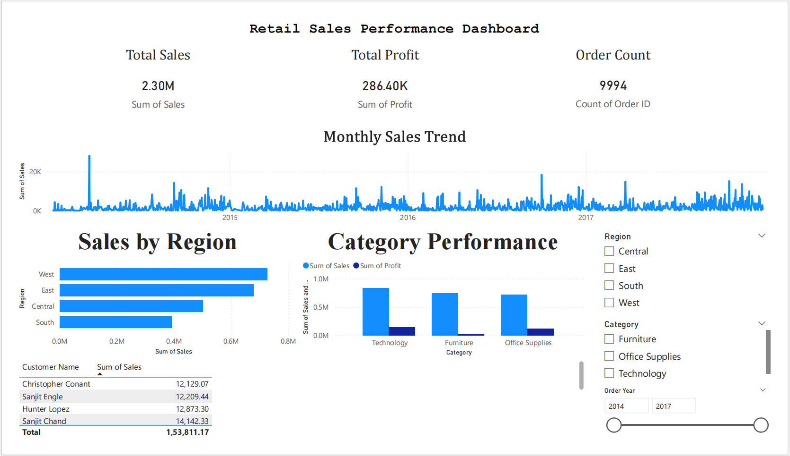

# Retail Sales Intelligence Dashboard

## 📌 Problem Statement

Businesses often struggle to derive actionable insights from raw sales data.  
This project aims to analyze retail sales data and provide meaningful insights into revenue trends, customer behavior, and product performance.

## 🛠️ Tools & Technologies

- Python (Pandas, NumPy)
- MySQL (Data Storage & Querying)
- Power BI (Dashboard & Visualization)
- Jupyter Notebook (EDA)

## 🔄 Project Workflow

1. Data Ingestion (CSV)
2. Data Cleaning & Transformation
3. Loading Data into MySQL
4. SQL Analysis
5. Exploratory Data Analysis (EDA)
6. Dashboard Creation in Power BI

## 🔍 Key Insights

- West region generates the highest revenue
- Technology category contributes the most profit
- Sales show seasonal trends across months
- A small number of customers drive major revenue

## ✅ Conclusion

This project demonstrates end-to-end data analysis, from raw data processing to business insights and visualization.
